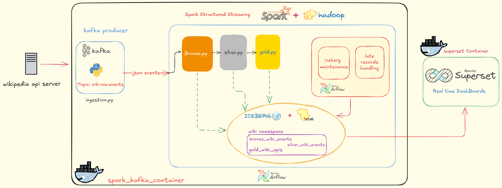
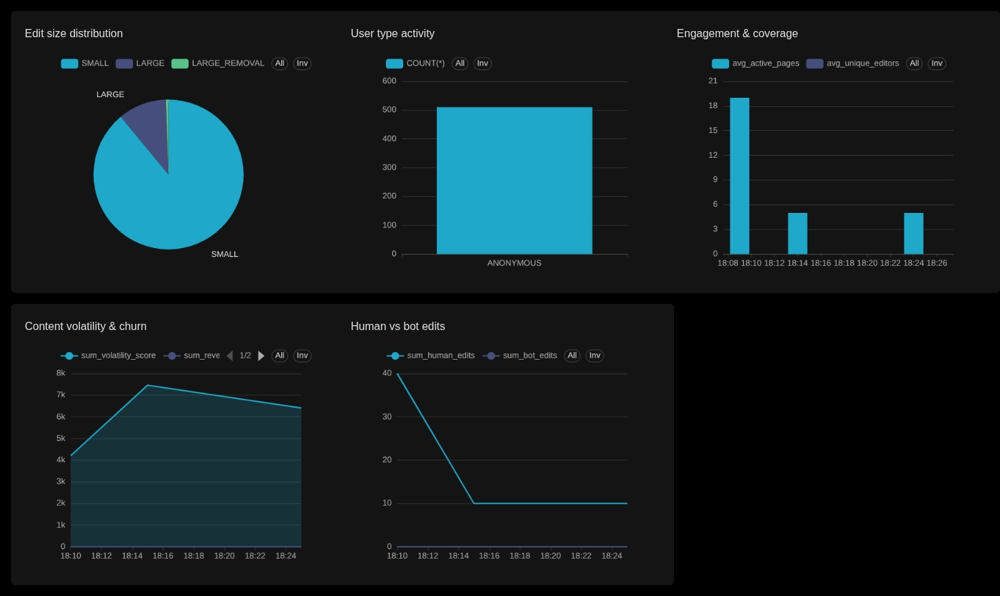

# 🌐 Wikipedia Real-Time Analytics Pipeline

[](https://spark.apache.org/)
[](https://kafka.apache.org/)
[](https://iceberg.apache.org/)
[](https://airflow.apache.org/)

> A production-grade, real-time streaming analytics platform that ingests Wikipedia edit events, processes them through a medallion architecture (Bronze → Silver → Gold), and visualizes insights through Apache Superset dashboards.


---

## 🎯 Overview

This project demonstrates a **modern data lakehouse architecture** for real-time analytics, streaming live Wikipedia edit events with sub-minute latency and providing actionable insights through interactive dashboards.

### Key Highlights

- **Real-time Processing**: Sub-minute latency from edit event to dashboard
- **Medallion Architecture**: Bronze (raw) → Silver (cleaned) → Gold (aggregated)
- **Scalable Design**: Handles millions of events per day
- **ACID Transactions**: Powered by Apache Iceberg for data reliability
- **Automated Maintenance**: Airflow DAGs for optimization and late-data handling
- **Rich Analytics**: 10+ KPIs tracking community engagement, bot activity, and content growth

---

## 🏗️ Architecture



### Data Flow
1. **Ingestion**: Wikipedia Recent Changes API → Kafka
2. **Processing**: Spark Structured Streaming with 3-layer transformation
3. **Storage**: Apache Iceberg tables on HDFS
4. **Orchestration**: Airflow manages pipeline execution and maintenance
5. **Visualization**: Apache Superset dashboards with auto-refresh

## Sample Dashboard



---

## 🛠️ Tech Stack

| Component | Technology | Purpose |
|-----------|-----------|---------|
| **Streaming** | Apache Kafka 3.6 | Event ingestion & buffering |
| **Processing** | Apache Spark 3.5.0 | Distributed stream processing |
| **Storage Format** | Apache Iceberg 1.5.2 | ACID-compliant table format |
| **Storage Layer** | HDFS 3.3.6 | Distributed file system |
| **Orchestration** | Apache Airflow 2.8 | Workflow scheduling |
| **Visualization** | Apache Superset 3.0 | Dashboards & reporting |

---

## 🚀 Getting Started

### Prerequisites
- Docker & Docker Compose
- Python 3.9+
- 16GB+ RAM recommended
- 50GB+ disk space

### Quick Setup

1. **Clone and configure**
   ```bash
   git clone https://github.com/SWARAJ-KADU/Wikipedia_real_time_data_events.git
   cd wikipedia-realtime-analytics
   cp .env.example .env
   ```

2. **Start infrastructure**
   ```bash
   docker-compose up -d
   pip install -r requirements.txt
   python scripts/init_schema.py
   ```

3. **Launch pipeline**
   - Access Airflow UI: http://localhost:8080
   - Trigger DAGs: `wiki_kafka_producer` → `wiki_streaming_pipeline`
   - View dashboards: http://localhost:8088 (admin/admin)

---

## 🔄 Data Pipeline

### Bronze Layer (Raw Ingestion)
- Ingests raw JSON events from Kafka with minimal transformation
- Preserves original data with metadata (partition, offset, timestamps)
- Output: `wiki.bronze_wiki_events`

### Silver Layer (Cleaned & Enriched)
- Parses JSON and validates schema
- Extracts nested fields and calculates derived metrics
- Classifies edits (size, user type) and deduplicates by event ID
- Output: `wiki.silver_wiki_events`

### Gold Layer (Business KPIs)
Computes 10+ metrics with 5-minute windows:
- **Platform Activity**: Total edits, unique editors, active pages
- **Automation**: Bot vs human edit counts and percentages
- **Content Metrics**: Net bytes added, edit intensity, volatility
- **Trend Analysis**: Knowledge growth trends (GROWING/SHRINKING/STABLE)
- Output: `wiki.gold_wiki_kpis`

---

## 🔧 Automated Maintenance

### Airflow DAGs

| DAG | Schedule | Purpose |
|-----|----------|---------|
| `wiki_kafka_producer` | Manual | Start Wikipedia event producer |
| `wiki_streaming_pipeline` | Manual | Launch Spark streaming application |
| `wiki_iceberg_maintenance` | Every 2 hours | Optimize tables (snapshots, compaction, orphan cleanup) |
| `wiki_late_data_correction` | Manual | Reprocess late-arriving events from last 24 hours |

---

## 📊 Dashboards

### 1. Real-Time Wiki Events Monitor (Silver)
Displays live edit stream with filtering by user type, edit size, and change type. Includes event velocity charts, user distribution, and top active pages.

### 2. Wikipedia KPI Analytics (Gold)
Comprehensive analytics with auto-refresh showing platform activity trends, bot vs human contribution, edit intensity, knowledge growth trends, and community engagement metrics.

---

## ⚡ Performance Features

- **Spark**: Adaptive query execution, backpressure, 200 shuffle partitions
- **Iceberg**: Fanout writes, 128-512 MB file targets, 5-12 snapshot retention
- **Kafka**: Snappy compression, optimized batching, replication factor 3
- **Watermarking**: 10-minute tolerance for late-data handling
- **Exactly-once semantics**: Kafka + Iceberg integration

---

## 🐛 Common Issues & Solutions

**No records in Gold table**: Reduce watermark threshold or check window closure logic

**Duplicate aggregations**: Reset checkpoints and truncate Gold table

**Superset connection issues**: Refresh metadata or create virtual datasets via SQL Lab

---

## 📁 Project Structure

```
wikipedia-realtime-analytics/
├── kafka/                # Event ingestion
├── streaming/            # Bronze/Silver/Gold processors
├── iceberg/              # Maintenance scripts
├── airflow/dags/         # Workflow orchestration
├── superset/dashboards/  # Dashboard exports
├── scripts/              # Initialization utilities
└── docker-compose.yml    # Infrastructure setup
```

---

## 🙏 Acknowledgments

Built with Apache Spark, Kafka, Iceberg, Airflow, and Superset. Data sourced from Wikipedia's real-time event stream.

---

## 📧 Contact

**SWARAJ KADU** - [LinkedIn](https://www.linkedin.com/in/swaraj-kadu-b263a7254)

---

<div align="center">

**⭐ Star this repo if you find it useful! ⭐**

Made with ❤️ and ☕ by SWARAJ

</div>